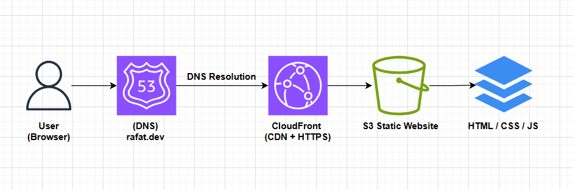
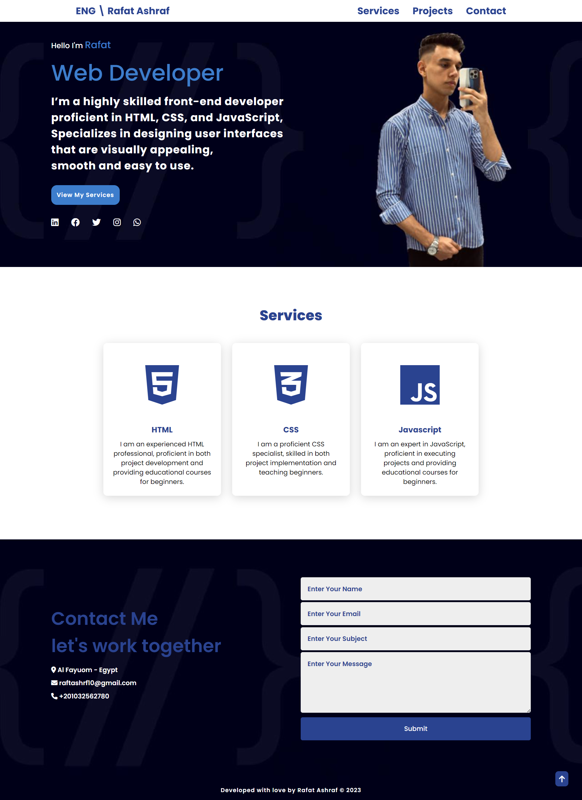

# 🌐 Rafat's Portfolio Website (Static Website on AWS)

---

## 📁 About the Project

This is a personal portfolio website designed to showcase my projects, skills, and contact information. The website is built as a **static website** and is fully hosted on **AWS Cloud**, leveraging key services for performance, scalability, and security.

---

## 🗺️ Architecture Diagram

---

## ☁️ Hosting Architecture

The project is deployed using the following AWS services:

- **Amazon S3**: Used to store the static HTML, CSS, and JS files.
- **Amazon CloudFront**: Acts as a CDN to distribute the website content globally with low latency.
- **Amazon Route 53**: Manages the custom domain and DNS routing.
- **(Optional)**: SSL certificate via AWS Certificate Manager for HTTPS support.

---

## 🧱 Tech Stack

- HTML5, CSS3, JavaScript
- Git & GitHub for version control
- AWS (S3, CloudFront, Route 53)

---

## 🚀 Deployment Steps on AWS

1. **Create S3 Bucket**  
   - Enable static website hosting  
   - Upload all website files (`index.html`, CSS, JS, images, etc.)

2. **Set Bucket Policy**  
   - Make the bucket publicly accessible by adding a bucket policy.

3. **Set Up CloudFront**  
   - Create a new CloudFront distribution with the S3 bucket as the origin.  
   - Enable "Redirect HTTP to HTTPS" if SSL is configured.  
   - Set default root object to `index.html`.

4. **Register Custom Domain** *(Optional)*  
   - Use Route 53 to register or configure a custom domain.

5. **Connect Domain with CloudFront**  
   - Add a new record set in Route 53 pointing to the CloudFront distribution.

6. **(Optional)**: Use AWS Certificate Manager (ACM) to create and validate an SSL certificate for your domain and enable HTTPS.

---

## 📸 Preview

---

## 📬 Contact

- **Name**: Rafat Ashraf  
- **Email**: raftashrf17@gmail.com  
- **LinkedIn**: [linkedin.com/in/rafat-devops](https://linkedin.com/in/rafat-devops)

